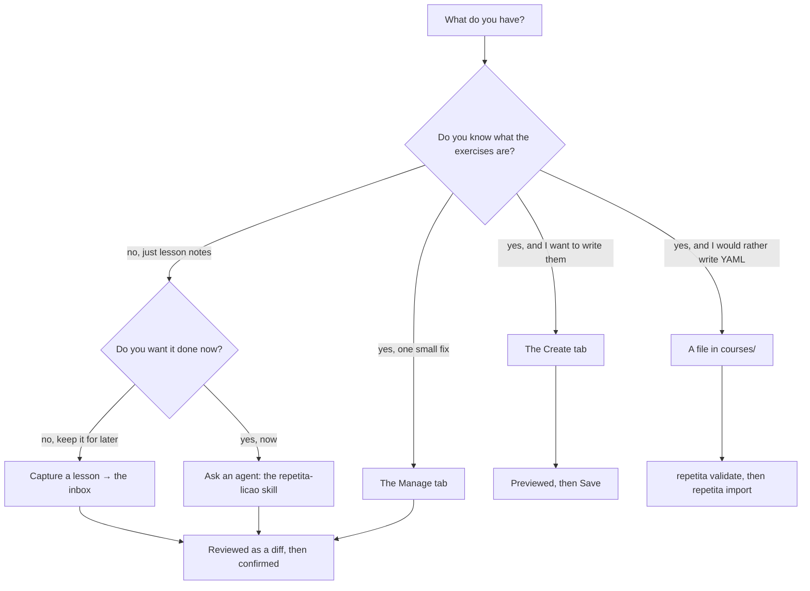

# Adding material: the ways in

There are six routes into the course, and the thing worth knowing before you
pick one is **who does the work**. Two of them delegate to an agent; the rest
are yours alone.

| you have | the way in | who does the work | what happens |
| --- | --- | --- | --- |
| notes from a lesson, half-formed | **Capture a lesson** → [the inbox](inbox.md) | **an agent**, when you ask | queued exactly as you wrote it, shaped later, reviewed as a diff |
| exercises to write, or a whole set | the **[Create](using/creating.md)** tab | **you**, in the app | written, previewed, saved |
| one exercise to fix | the **[Manage](using/managing.md)** tab | **you**, in the app | staged, then Confirm |
| a whole unit, written properly | a YAML file in `courses/` | **you**, in an editor | `repetita validate` checks it, then `repetita import` brings it in |
| a lesson you want turned into exercises now | the `repetita-licao` skill | **an agent**, in the terminal | writes the course file, imports it and reloads |
| someone else's course | fork the directory | — | it is CC BY-SA |

---

## 1. The inbox — when it is not exercises yet

**Manage → Capture a lesson.** Paste what you have and close the box.

```
lekcja 11.09 — futuro simples
  vou + infinitivo
  ex: vou estudar amanhã
       ela vai trabalhar no sábado
  nowe słowa z feiry: jaca, caju, umbu
  ! o/a — umbu jest "o"?
```

Nothing is parsed. It is kept byte for byte and queued, and the button shows how
many are waiting. Later — a day later, whenever you ask — an agent reads the
queue and turns that draft into exercises:

```yaml
- id: licao-2026-09-11.futuro-vou-01
  notetype: gap
  cue: vou — futuro simples, eu
  prompt: "Amanhã ___ estudar português."
  answers: [vou]
```

and you review the result as an ordinary diff before confirming it.

This is the route designed for how a lesson actually arrives: scribbled,
mid-sentence, in two languages, not yet exercises. **[The inbox](inbox.md)** has
the full loop, including the agent's side of it.

!!! warning "What the queue does not do"

    Nothing in it is studied, scheduled, counted or validated. It is not
    material until an agent has shaped it and you have confirmed the result, and
    nothing converts itself in the background. The failure mode is a visible
    backlog, not silently wrong material.

## 2. The Create tab — writing exercises yourself

**Create** is where material is written: a set at a time, any of the six exercise
types, every field including the optional ones, and a preview rendered by the
same code the Study tab uses so you can see what you are making. It opens an
existing set as readily as a new one, and **Save** writes it — there is no
Confirm step, because a new exercise replaces nothing.

```
prompt *    Amanhã eu ___ estudar.
answers *   vou
asked as    [typein] [word bank] [multiple choice]
            choice: needs 2 wrong answers to choose between, has 0
```

Use it when you know what the exercises are. [Writing exercises](using/creating.md)
is the whole of it, including how to choose the form an exercise is asked in.

## 3. The Manage tab — one exercise, in place

For fixing a typo, retagging, moving something between sets, removing a set. You
are in the app, the change is staged, and **Confirm** applies it. See
[Managing your material](using/managing.md).

Use this when you know exactly what you want to change about material that
already exists. It is the shortest route of all.

## 4. A YAML file — a whole unit, written properly

The reviewable format, and what a pull request contains. Note the order of those
words: since [ADR-0015](architecture/decisions/0015-yaml-is-a-way-in-and-a-way-out.md)
the database is what the app reads, and a file here is material **on its way in
or on its way out** — never the thing being studied. Writing one changes nothing
until you import it.

```yaml
# courses/pt-br-from-pl/units/07/notes/comida.yaml
notetype: vocab
tags: [A2, vocabulario, comida]
notes:
  - id: comida.feira
    l2: a feira
    l1: targ
  - id: comida.caju
    l2: o caju
    l1: nerkowiec
```

```bash
repetita validate courses/pt-br-from-pl --strict   # check it
repetita import courses/pt-br-from-pl             # bring it in
```

Validation is the point of this route: it refuses material that gives away its
own answer, refuses a malformed date rather than ignoring it, and never coerces
a value into the wrong type.

The import shows you what it will do before it does it, and **never overwrites
something you edited in the app** — where both changed, you are asked. It also
names every exercise it would archive, because a file that no longer mentions an
exercise is how you remove one, and that is the part running it again does not
undo. A directory with no `course.yaml` is treated as a fragment and archives
nothing at all.

If you would rather not use a terminal: Manage → Import / export does both
directions, with the same preview.

The one thing to be careful about: **never change an existing `id` by editing the
file.** It is the key your progress is stored under, and a key edited in YAML
leaves the history behind. Adding and removing are free, and an id that needs
changing is changed with `repetita rename-id`, which takes the history with it.

## 5. The `repetita-licao` skill — a lesson, turned into exercises now

An agent, in the terminal, with the lesson in front of it. It writes the course
file, follows the course's existing conventions for note types, ids and tags,
imports it and reloads. The difference from the inbox is only *when*: this is for "do it now",
the inbox is for "keep this until I ask".

Either way an agent is doing the shaping, and either way you review a diff.

## 6. Somebody else's course

Fork the directory. Course content under `courses/` is **CC BY-SA 4.0** — share
it on, keep the licence. The engine itself is MIT. See
[Third-party material](THIRD-PARTY.md).

---

## Which one should I use?



Every route ends the same way: a change you can see before it becomes material
you study.
