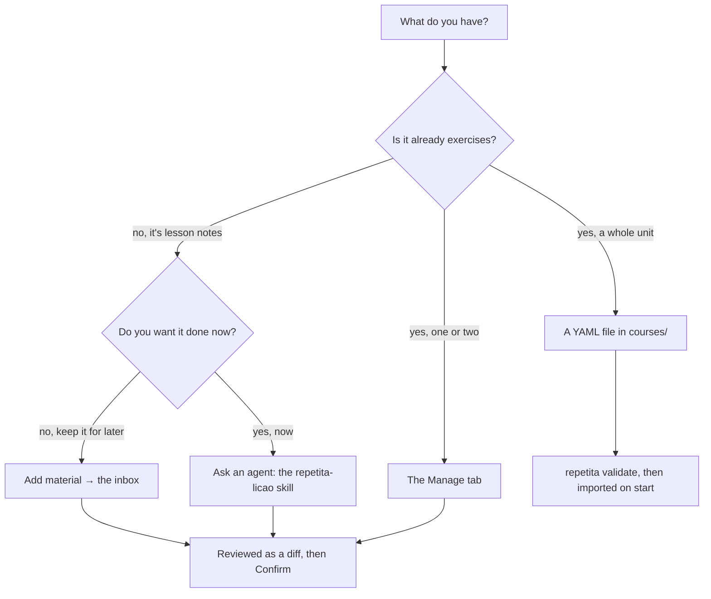

# Adding material: the four ways in

There are four routes into the course, and the thing worth knowing before you
pick one is **who does the work**. Two of them delegate to an agent; two are
yours alone.

| you have | the way in | who does the work | what happens |
| --- | --- | --- | --- |
| notes from a lesson, half-formed | **Add material** → [the inbox](inbox.md) | **an agent**, when you ask | queued exactly as you wrote it, shaped later, reviewed as a diff |
| one exercise to fix or add | the **[Manage](using/managing.md)** tab | **you**, in the app | staged, then Confirm |
| a whole unit, written properly | a YAML file in `courses/` | **you**, in an editor | imported on start; `repetita validate` checks it |
| a lesson you want turned into exercises now | the `repetita-licao` skill | **an agent**, in the terminal | writes the course file and reloads |
| someone else's course | fork the directory | — | it is CC BY-SA |

---

## 1. The inbox — when it is not exercises yet

**Manage → Add material.** Paste what you have and close the box.

```
lekcja 11.09 — futuro simples
  vou + infinitivo
  ex: vou estudar amanhã
       ela vai trabalhar no sábado
  nowe słowa z feiry: jaca, caju, umbu
  ! o/a — umbu jest "o"?
```

Nothing is parsed. It is kept byte for byte and queued, and the button shows how
many are waiting. Later — a day later, whenever you ask — an agent reads the
queue and turns that draft into exercises:

```yaml
- id: licao-2026-09-11.futuro-vou-01
  notetype: gap
  cue: vou — futuro simples, eu
  prompt: "Amanhã ___ estudar português."
  answers: [vou]
```

and you review the result as an ordinary diff before confirming it.

This is the route designed for how a lesson actually arrives: scribbled,
mid-sentence, in two languages, not yet exercises. **[The inbox](inbox.md)** has
the full loop, including the agent's side of it.

!!! warning "What the queue does not do"

    Nothing in it is studied, scheduled, counted or validated. It is not
    material until an agent has shaped it and you have confirmed the result, and
    nothing converts itself in the background. The failure mode is a visible
    backlog, not silently wrong material.

## 2. The Manage tab — one exercise, by hand

For fixing a typo, adding a hint, retagging, moving something between sets, or
adding a single exercise to a set that already exists. You are in the app, the
change is staged, and **Confirm** applies it. See
[Managing your material](using/managing.md).

Use this when you know exactly what you want to change. It is the shortest route
and the only one where nothing else has to happen afterwards.

## 3. A YAML file — a whole unit, written properly

The authoring format, and what a pull request contains.

```yaml
# courses/pt-br-from-pl/units/07/notes/comida.yaml
notetype: vocab
tags: [A2, vocabulario, comida]
notes:
  - id: comida.feira
    l2: a feira
    l1: targ
  - id: comida.caju
    l2: o caju
    l1: nerkowiec
```

```bash
repetita validate courses/pt-br-from-pl --strict
```

Validation is the point of this route: it refuses material that gives away its
own answer, refuses a malformed date rather than ignoring it, and never coerces
a value into the wrong type. Files are imported at startup, and **an import never
overwrites something you edited in the app** — where both changed, you are asked.

The one unbreakable rule: **never change an existing `id`.** It is the key your
progress is stored under. Adding and removing are fine; renaming silently
deletes history.

## 4. The `repetita-licao` skill — a lesson, turned into exercises now

An agent, in the terminal, with the lesson in front of it. It writes the course
file, follows the course's existing conventions for note types, ids and tags, and
reloads. The difference from the inbox is only *when*: this is for "do it now",
the inbox is for "keep this until I ask".

Either way an agent is doing the shaping, and either way you review a diff.

## 5. Somebody else's course

Fork the directory. Course content under `courses/` is **CC BY-SA 4.0** — share
it on, keep the licence. The engine itself is MIT. See
[Third-party material](THIRD-PARTY.md).

---

## Which one should I use?



Every route ends the same way: a change you can see before it becomes material
you study.
