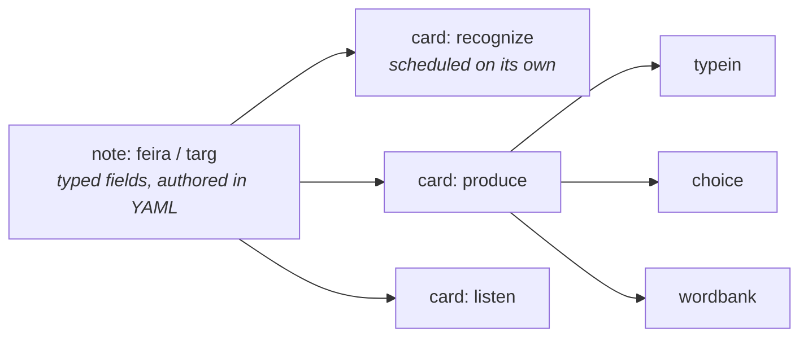
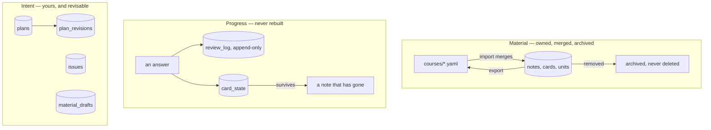
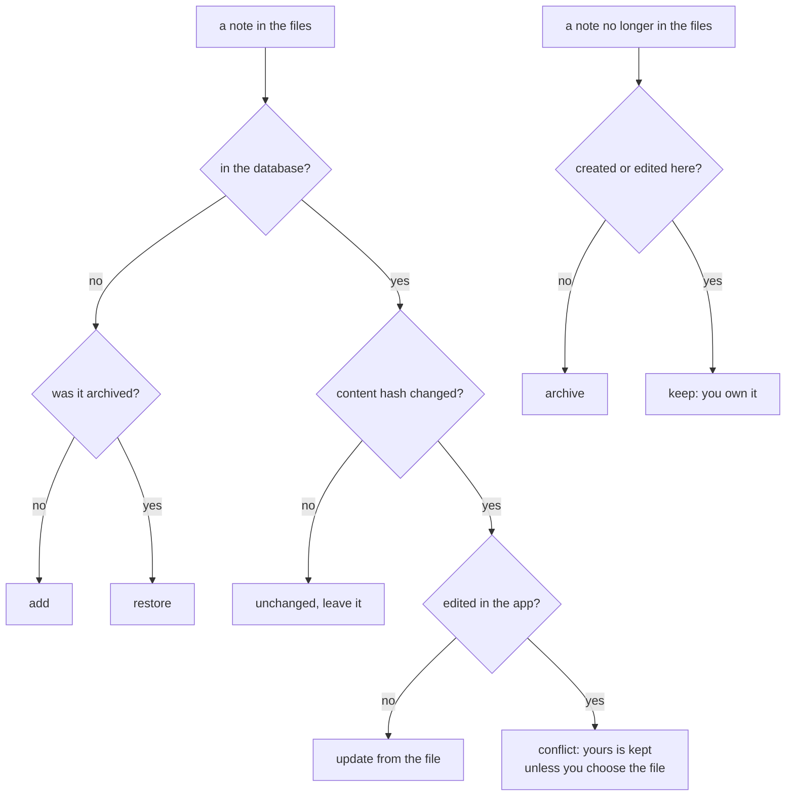

# How it works

Three ideas explain most of this system. Everything else is consequence.

## 1. Note → card → form

A **note** is one atom of knowledge. A **card** is one question about it. A
**form** is how that question is asked today.



One note becomes several cards, and **each card is scheduled separately**.
Knowing what *saudade* means and being able to produce it are different
knowledge and decay at different rates; a flashcard with two sides cannot say
that. The form is chosen per showing, so the same card can be a typed answer
today and a multiple choice next week — which is a presentation decision, not a
scheduling one.

[ADR-0001](architecture/decisions/0001-note-card-form.md) has the reasoning, and
what it rules out.

## 2. Three kinds of data, three different rules

This is the single most important thing to know before changing anything here.



**Material** is owned by the database ([ADR-0006](architecture/decisions/0006-the-database-owns-the-material.md)).
Course files are an import/export format, not the source of truth: an import
merges, a note you edited here is not overwritten, and material that leaves the
files is *archived, never deleted*.

**Progress** is never rebuilt from anything. Not on startup, not on import, not
when a note is edited. Deleting material would orphan history that cannot be
reconstructed, which is also why this schema has **no foreign keys**.

**Intent** is what you told the system you wanted: plans, issues, and the
[inbox](inbox.md). Revisable by definition, and versioned where a later question
depends on it — every answer records which plan *revision* produced it
([ADR-0007](architecture/decisions/0007-a-plan-is-data.md)).

## 3. An exercise may never contain its own answer

The system this replaced had a hint reading `fim de semana = weekend` for the
answer *fim de semana*: the exercise handed over its own solution. It happened
because one field was doing two jobs — posing the task *and* restating the rule.

So every field declares **when it may be seen**: with the question, or after
answering. A note whose answer appears in a before-field is **quarantined** —
dropped from the pool, listed in the UI, and a non-zero exit from
`repetita validate`. Not a console warning: the predecessor had one of those and
70 of 330 items leaked anyway.

And the answer does not reach the browser while a question is open. One
serialisation path, `public_card`, decides what an open question carries; grading
happens on the server ([ADR-0005](architecture/decisions/0005-the-client-never-sees-a-card-id.md)).

The [Manage tab](using/managing.md) is the one deliberate exception, and
[ADR-0008](architecture/decisions/0008-the-management-surface-sees-everything.md)
argues why that is not the same leak.

## What an import decides

Both the preview and the import itself run one function, so the screen that says
what will happen cannot disagree with what happens.



The rule underneath it, learned three times here — for notes, then cards, then
units — is one sentence: **whatever the app creates or changes, it records that
it did, or the next import undoes it.**

## The layers

```
core/        notes, cards, protocols, Judgement, Response  -- no I/O, no Flask
srs/         scheduler backends: sm2, fsrs6, leitner       -- pure functions
graders/     typed, sentence, choice, self                 -- pure functions
presenters/  which form to show a card in right now
policies/    what goes into a session: daily, cram, test, match, rehearse
difficulty/  which level to ask at (separate from when)
content/     pydantic models, YAML loader, validator, labels
store/       SQLite: schema, migrations, queries, the inbox
web/         Flask blueprint, API, templates, static
```

`core/` imports nothing else. `srs/` may import `core` and nothing more: **the
scheduler is pure** — no clock, no database, no uninjected randomness — because
it is the one place where a subtle bug costs months of study before anyone
notices.

Four things are extension points, each a `Protocol` with a registry, so adding
one is a new file rather than a change to the core: **scheduler backend**,
**grader**, **presenter**, **session policy**.

## Where to go next

- [The database](schema.md) — every table, generated from the schema itself.
- [Names](labels.md) — how an exercise gets a short handle.
- [Tagging](tagging.md) — how a course's tags are organised, and how to change
  them safely.
- [Tuning](tuning.md) — the constants, what each one does, and what happens if
  you move it.
- [Decisions](architecture/decisions/README.md) — every ADR, with the
  measurement that decided it.
