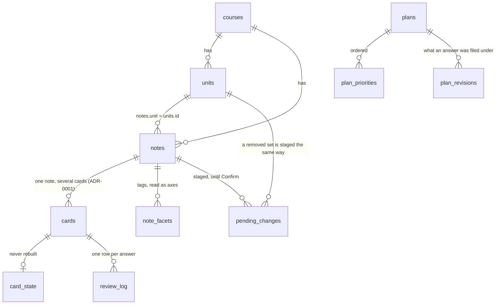

# The database

<!--
  GENERATED FILE -- do not edit.
  Written by scripts/gen_schema_doc.py from the SCHEMA string in
  src/repetita/store/db.py. Edit the schema there; CI checks this page matches.
-->

SQLite, one file, **schema version 9**. 23 tables, and the whole
of it is in [`store/db.py`](https://github.com/mikub97/repetita/blob/main/src/repetita/store/db.py).

Two things explain most of the shape of it.

**Content and progress are different kinds of data.** `notes`, `cards` and
`units` are *material*: since [ADR-0006][adr6] the database owns them, an import
merges into them, and material that leaves the
course is archived rather than deleted. `card_state` and `review_log` are
*history*: they are never rebuilt from anything, ever. That asymmetry is the one
rule you cannot break here.

**There are no foreign keys, on purpose.** A card whose note has gone keeps its
history, and a `card_state` row outlives whatever it was about. Enforcing
referential integrity would mean deleting someone's schedule to keep the
database tidy.

## The tables

[adr6]: architecture/decisions/0006-the-database-owns-the-material.md

### `meta`

| column | notes |
| --- | --- |
| `key TEXT PRIMARY KEY, value TEXT NOT NULL` |  |

### `courses`

The course itself, and its units. Owned like the rest of the material.
`units.title` and `cefr` come from `unit.yaml`, and `requires`/`ord` from
`course.yaml`'s `path` -- three pieces of structure that were authored and
parsed from the start and reached no query until they landed here.

| column | notes |
| --- | --- |
| `id TEXT PRIMARY KEY` |  |
| `title TEXT NOT NULL DEFAULT '{}'` | JSON, i18n |
| `l1 TEXT` |  |
| `l2 TEXT` |  |
| `variant TEXT` |  |
| `license TEXT NOT NULL DEFAULT '{}'` | JSON |
| `grading TEXT NOT NULL DEFAULT '{}'` | JSON |
| `scheduler TEXT` |  |
| `tag_weights TEXT NOT NULL DEFAULT '{}'` | JSON |
| `family TEXT` | JSON: how several forms of one word are marked |
| `format_version INTEGER NOT NULL DEFAULT 1` |  |
| `imported_at TEXT` |  |

### `units`

| column | notes |
| --- | --- |
| `course TEXT NOT NULL` |  |
| `id TEXT NOT NULL` | the directory name; notes.unit joins on it |
| `title TEXT NOT NULL DEFAULT '{}'` | JSON, i18n |
| `description TEXT NOT NULL DEFAULT '{}'` | JSON, i18n |
| `cefr TEXT` |  |
| `ord INTEGER NOT NULL DEFAULT 0` | position in course.path |
| `requires TEXT NOT NULL DEFAULT '[]'` | JSON array of unit ids |
| `edited_at TEXT` | Made or renamed here rather than read out of a directory. Without it an import archives every unit it does not find in the files -- which is every unit the app has ever created. Notes learned this the hard way and so did cards; this is the same rule, written down once. |
| `archived_at TEXT` |  |
| `PRIMARY KEY (course, id)` |  |

### `notetypes`

A course's own exercise types (ADR-0012), as declared in `notetypes.yaml`.
Built-in types are code and are never stored: `notetypes.builtin()` is the
floor and these are layered over it, exactly as the loader layers them.

Here because the database has to be able to describe a course without the
files. This was the last piece of content an import parsed and then threw
away, and a note whose type nothing declares cannot be expanded or graded --
so without this row a DB-only start would quarantine every note using one.

| column | notes |
| --- | --- |
| `course TEXT NOT NULL` |  |
| `name TEXT NOT NULL` |  |
| `spec TEXT NOT NULL` | JSON: the NoteType as declared |
| `edited_at TEXT` | written here rather than imported |
| `archived_at TEXT` | gone from the source. Never deleted |
| `PRIMARY KEY (course, name)` |  |

### `facet_axes`

How a course reads its own tags. `note_facets` is the join table that makes
GROUP BY possible: `notes.tags` is a JSON array in a TEXT column and cannot be
indexed, joined or grouped, which is why it was written by every sync and read
by no query at all.

| column | notes |
| --- | --- |
| `course TEXT NOT NULL` |  |
| `axis TEXT NOT NULL` | level \| track \| topic \| source \| ... |
| `title TEXT NOT NULL DEFAULT '{}'` |  |
| `ordered INTEGER NOT NULL DEFAULT 0` |  |
| `catch_all INTEGER NOT NULL DEFAULT 0` |  |
| `max_per_note INTEGER` |  |
| `ord INTEGER NOT NULL DEFAULT 0` |  |
| `PRIMARY KEY (course, axis)` |  |

### `facet_values`

| column | notes |
| --- | --- |
| `course TEXT NOT NULL` |  |
| `axis TEXT NOT NULL` |  |
| `value TEXT NOT NULL` |  |
| `title TEXT NOT NULL DEFAULT '{}'` |  |
| `ord INTEGER NOT NULL DEFAULT 0` |  |
| `PRIMARY KEY (course, axis, value)` |  |

### `note_facets`

A note may sit under several values of one axis. That is the ordinary case,
not an edge one: material about ordering food in a market is genuinely both
`comida` and `cidade`, and forcing a choice loses real information.

| column | notes |
| --- | --- |
| `note_id TEXT NOT NULL` |  |
| `axis TEXT NOT NULL` |  |
| `value TEXT NOT NULL` |  |
| `PRIMARY KEY (note_id, axis, value)` |  |

### `notes`

Material. Owned, merged and archived -- not a cache (ADR-0006).

| column | notes |
| --- | --- |
| `id TEXT PRIMARY KEY` |  |
| `course TEXT NOT NULL` |  |
| `unit TEXT NOT NULL` |  |
| `notetype TEXT NOT NULL` |  |
| `ord INTEGER NOT NULL` |  |
| `tags TEXT NOT NULL` | JSON array |
| `lesson TEXT` | YYYY-MM-DD, or NULL for the back catalogue |
| `fields TEXT NOT NULL` | JSON |
| `csum INTEGER NOT NULL` | checksum of the first field, for duplicate hunting |
| `origin TEXT` | Ownership (ADR-0006). A note is no longer thrown away and rebuilt, so it needs to say where it came from and whether anyone has touched it since. authored file, or NULL for a note made here |
| `content_hash TEXT` | of the authored content, as last imported |
| `created_at TEXT` |  |
| `updated_at TEXT` |  |
| `edited_at TEXT` | non-NULL: changed here, so an import must not clobber it |
| `archived_at TEXT` | gone from the source. NEVER deleted: see ADR-0006 |
| `label TEXT` | A short name, so three screens can refer to one exercise without falling back to its id. Derived from the answer; see `content/labels.py` for why not from the cue. A *name*, not an identifier -- fifteen exercises in one set legitimately answer `o`, and the id is what tells them apart. |
| `label_custom INTEGER NOT NULL DEFAULT 0` | Set when a person writes the name themselves, so editing the exercise does not quietly overwrite a name someone chose. |
| `forms TEXT` | How this exercise is asked, when its author disagreed with its type. JSON `{"<template>": ["typein", ...]}`; NULL means "whatever the note type says", which is the case for everything that came out of a file. Per template because a form is a property of a card and one note can have several -- `vocab` has three. See ADR-0010. |

### `cards`

| column | notes |
| --- | --- |
| `id TEXT PRIMARY KEY` | <note_id>#<template> |
| `note_id TEXT NOT NULL` |  |
| `template TEXT NOT NULL` |  |
| `notetype TEXT NOT NULL` |  |
| `grader TEXT NOT NULL` |  |
| `forms TEXT NOT NULL` | JSON array |
| `scheduled INTEGER NOT NULL DEFAULT 1` |  |
| `archived_at TEXT` | as notes.archived_at |

### `card_state` *(history — never rebuilt)*

Progress. NEVER rebuilt from content.

| column | notes |
| --- | --- |
| `user_id INTEGER NOT NULL DEFAULT 1` |  |
| `card_id TEXT NOT NULL` |  |
| `algo TEXT NOT NULL` |  |
| `algo_version INTEGER NOT NULL` |  |
| `state TEXT NOT NULL` | JSON, private to the backend named in `algo` |
| `due TEXT` | Denormalised so the queue and the counters never parse `state`: |
| `last TEXT` |  |
| `interval INTEGER NOT NULL DEFAULT 0` |  |
| `seen INTEGER NOT NULL DEFAULT 0` |  |
| `correct INTEGER NOT NULL DEFAULT 0` |  |
| `wrong INTEGER NOT NULL DEFAULT 0` |  |
| `lapses INTEGER NOT NULL DEFAULT 0` |  |
| `retired_at TEXT` |  |
| `retired_reason TEXT` |  |
| `suspended_at TEXT` |  |
| `bucket TEXT` | Which stage of learning this card is at, denormalised so material can be grouped by it in SQL. Written from `core.buckets.bucket_of`, which is the single definition -- a threshold that decides policy must not get a second one in a WHERE clause (ADR-0002). |
| `PRIMARY KEY (user_id, card_id)` |  |

### `review_log` *(history — never rebuilt)*

Append-only. The only thing that makes switching or tuning a scheduler
possible later, and it cannot be reconstructed after the fact.

| column | notes |
| --- | --- |
| `id INTEGER PRIMARY KEY AUTOINCREMENT` |  |
| `user_id INTEGER NOT NULL DEFAULT 1` |  |
| `card_id TEXT NOT NULL` |  |
| `rating INTEGER NOT NULL` | 1..4 |
| `review_datetime TEXT NOT NULL` | ISO 8601, aware, UTC |
| `day TEXT NOT NULL` | LOCAL calendar day; counters and streaks use it |
| `review_duration_ms INTEGER` |  |
| `elapsed_days REAL` | actual time since the previous review |
| `algo TEXT NOT NULL` |  |
| `state_before TEXT` | JSON snapshot, for replay and optimisation |
| `mode TEXT NOT NULL DEFAULT 'session'` |  |
| `form TEXT NOT NULL DEFAULT 'typein'` |  |
| `answer TEXT` | including WRONG answers: tomorrow's distractors |
| `plan_revision_id INTEGER` | Which revision of which study plan produced this answer. ADR-0003 exists because the predecessor kept aggregates and threw the sequence away, and that is the one decision that cannot be undone later. "Did making it harder help?" is the same shape of question, so this is recorded from day one. |

### `distractors`

Wrong answers offered beside a right one. Part of the content cache: derived
from the course files, rebuilt with them, and deterministic so a rebuild does
not churn. Precomputed rather than chosen per request because which options a
question offers is a property of the material, and one a reviewer can inspect.

| column | notes |
| --- | --- |
| `card_id TEXT NOT NULL` |  |
| `text TEXT NOT NULL` |  |
| `source TEXT NOT NULL` | curated \| same_unit \| paradigm \| frequency \| mined |
| `rank INTEGER NOT NULL` |  |
| `PRIMARY KEY (card_id, text)` |  |

### `card_handles`

The tokens the client sees in place of card ids. Persisted rather than minted
per run: an answer queued while offline is posted after the connection comes
back, and if the server restarted in between, a per-run handle would resolve to
nothing and a real answer would be lost. A stable token gives away nothing --
it is random, and it says nothing about the material (ADR-0005).

| column | notes |
| --- | --- |
| `card_id TEXT PRIMARY KEY` |  |
| `handle TEXT NOT NULL UNIQUE` |  |

### `card_reports`

A learner's claim that an *exercise* is broken, as opposed to hard.

Neither content nor progress, which is why it is its own table. It cannot live
in `notes`/`cards`: those are wiped and rebuilt from the very files the report
is complaining about. It must not live in `review_log`: a report is not an
answer, and letting it in would corrupt every accuracy figure computed from
there -- including the gate that decides how fast new material arrives.

Append-only in the same spirit as `review_log`. A card reported twice for two
reasons is two facts; `resolved_at` closes one without erasing it.

| column | notes |
| --- | --- |
| `id INTEGER PRIMARY KEY AUTOINCREMENT` |  |
| `user_id INTEGER NOT NULL DEFAULT 1` |  |
| `card_id TEXT NOT NULL` |  |
| `reason TEXT NOT NULL` | a code from reports.REASONS, never prose |
| `note TEXT` | optional free text from the learner |
| `reported_at TEXT NOT NULL` | ISO 8601, aware, UTC |
| `day TEXT NOT NULL` | LOCAL calendar day, as review_log |
| `note_id TEXT NOT NULL` | The snapshot. The exercise can be edited, archived or reworded between the report and the triage, so by the time anyone reads this the text that provoked it may be gone -- and a report that cannot say what was on screen says only "something was wrong once". (The reasoning used to be "content is rebuilt on every load", which stopped being true at ADR-0006; the column earns its place either way, for a better reason.) |
| `template TEXT NOT NULL` |  |
| `form TEXT NOT NULL` |  |
| `origin TEXT` | the authored file, from Note.origin |
| `unit TEXT` |  |
| `fields TEXT NOT NULL` | JSON: the note as authored, at report time |
| `given TEXT` | what the learner last typed, from review_log |
| `suspended INTEGER NOT NULL DEFAULT 0` | Whether THIS report is what took the card out of the queue. Not derivable afterwards: a card can already be suspended for another reason (the importer carries suspensions across), and an undo must put back only what it took. |
| `resolved_at TEXT` | NULL while open |

### `tag_aliases`

Renamed tags keep resolving. A tag carries no scheduling state, so unlike an
item id -- which is renamed with `repetita rename-id`, so that the history
comes too -- it can simply be renamed. But plans and facets.yaml refer to a
tag by value, so the old name has to keep meaning something.

| column | notes |
| --- | --- |
| `course TEXT NOT NULL` |  |
| `old TEXT NOT NULL` |  |
| `new TEXT NOT NULL` |  |
| `renamed_at TEXT NOT NULL` |  |
| `PRIMARY KEY (course, old)` |  |

### `material_issues`

"This grouping is wrong." An observation about how material is *organised*,
as opposed to `card_reports`, which says one exercise is broken and suspends
it. This suspends nothing. Same reasoning that keeps reports out of
`review_log`: a report is not an answer, and an issue is not a report.

| column | notes |
| --- | --- |
| `id INTEGER PRIMARY KEY AUTOINCREMENT` |  |
| `user_id INTEGER NOT NULL DEFAULT 1` |  |
| `kind TEXT NOT NULL` | taxonomy \| coverage \| balance \| duplicate \| other |
| `body TEXT NOT NULL` | the learner's own words |
| `selector TEXT` | what they were looking at, e.g. "topic=tempo" |
| `raised_at TEXT NOT NULL` |  |
| `resolved_at TEXT` |  |
| `resolution TEXT` |  |

### `study_plans`

Intent: what the learner wants studied, as opposed to what they have studied.
Never rebuilt from content.

| column | notes |
| --- | --- |
| `id INTEGER PRIMARY KEY AUTOINCREMENT` |  |
| `user_id INTEGER NOT NULL DEFAULT 1` |  |
| `name TEXT NOT NULL` |  |
| `course TEXT NOT NULL` |  |
| `active INTEGER NOT NULL DEFAULT 0` |  |
| `created_at TEXT NOT NULL` |  |
| `updated_at TEXT NOT NULL` |  |

### `plan_priorities`

The draggable list. `weight` NULL means derive it from `rank`.

| column | notes |
| --- | --- |
| `plan_id INTEGER NOT NULL` |  |
| `rank INTEGER NOT NULL` |  |
| `axis TEXT NOT NULL` | topic \| track \| level \| unit \| notetype |
| `value TEXT NOT NULL` |  |
| `weight REAL` |  |
| `PRIMARY KEY (plan_id, axis, value)` |  |

### `plan_knobs`

One row per knob so a change is diffable rather than a rewritten blob.

| column | notes |
| --- | --- |
| `plan_id INTEGER NOT NULL` |  |
| `key TEXT NOT NULL` |  |
| `value TEXT NOT NULL` | JSON scalar |
| `PRIMARY KEY (plan_id, key)` |  |

### `plan_revisions`

Append-only. What the plan looked like when a session was built under it.

| column | notes |
| --- | --- |
| `id INTEGER PRIMARY KEY AUTOINCREMENT` |  |
| `plan_id INTEGER NOT NULL` |  |
| `changed_at TEXT NOT NULL` |  |
| `snapshot TEXT NOT NULL` | JSON: priorities + knobs at this moment |

### `pending_changes`

Edits made in the app and not yet applied.

Server-side rather than held in the page, so that a refresh, a second tab or
a crash does not lose work, and so Confirm can show what will actually change
rather than a count. One row per (note, kind): the newest statement of an
intention replaces the previous one, because two edits to the same field are
not two changes, they are one change made twice.

| column | notes |
| --- | --- |
| `user_id INTEGER NOT NULL DEFAULT 1` |  |
| `note_id TEXT NOT NULL` |  |
| `kind TEXT NOT NULL` | fields \| tags \| unit \| archive \| restore |
| `payload TEXT NOT NULL` | JSON: the proposed value |
| `created_at TEXT NOT NULL` |  |
| `PRIMARY KEY (user_id, note_id, kind)` |  |

### `material_drafts`

Material captured before it has been shaped into exercises.

Raw text, on purpose, which is the opposite of everything else in this schema
(ADR-0009). A lesson is written down in one state of mind and turned into
exercises in another, and making the first wait for the second loses the note.
Nothing here is studied, counted or validated until an agent has shaped it and
a person has confirmed the result.

Kept after processing rather than deleted: the note is the provenance of the
exercises that came out of it, and the thing to re-read when one is wrong.

| column | notes |
| --- | --- |
| `id INTEGER PRIMARY KEY AUTOINCREMENT` |  |
| `user_id INTEGER NOT NULL DEFAULT 1` |  |
| `body TEXT NOT NULL` | exactly what was pasted, never reformatted |
| `created_at TEXT NOT NULL` |  |
| `processed_at TEXT` |  |
| `outcome TEXT` | what was made from it, written by whoever did |

### `containers`

Per-scope session preferences and cursor, separate from content and progress.

| column | notes |
| --- | --- |
| `user_id INTEGER NOT NULL DEFAULT 1` |  |
| `scope TEXT NOT NULL` | course:<id> \| unit:<id> \| chapter:<id> |
| `viewed_at TEXT` |  |
| `settings TEXT NOT NULL DEFAULT '{}'` |  |
| `PRIMARY KEY (user_id, scope)` |  |

## How they join

Foreign keys are not declared -- these are the joins the queries actually make.

`material_drafts` joins nothing. That is the point of it: raw material waiting to
be shaped, belonging to no course until an agent has made exercises from it
([ADR-0009](architecture/decisions/0009-material-is-captured-before-it-is-shaped.md)).

## Migrations

Every version is one entry in `MIGRATIONS`, and `SCHEMA` above is the cumulative result of applying all of them. A fresh database gets `SCHEMA`; an existing one gets the migrations it has not seen. Both paths have to end in the same place, which is why the contract is written down and not merely intended.

There are 7 of them, the most recent taking the schema to version 9.
